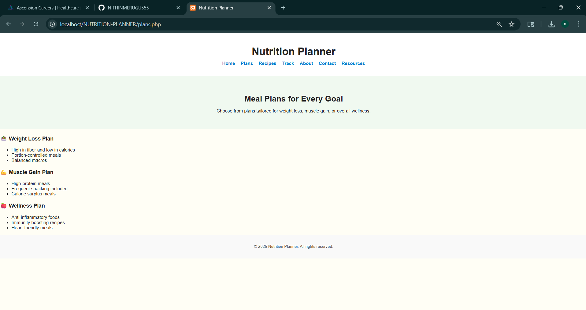
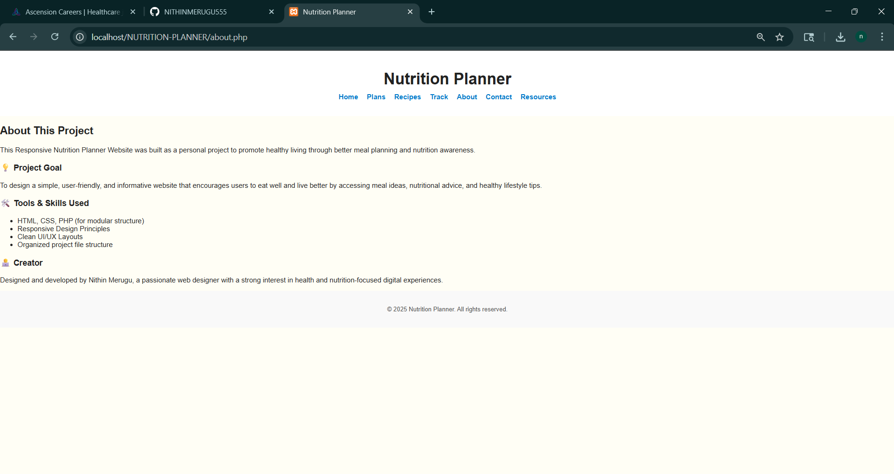

# Nutrition-planner

## Project Overview

Nutrition Planner is a clean, modular, and fully responsive website built with PHP, designed to help users plan meals, browse healthy recipes, and track daily nutrition seamlessly. 

The project emphasizes PHP-based modular architecture with reusable components like headers and footers, enabling easier maintenance and consistent site-wide navigation. It features semantic HTML5 markup and CSS3 for accessible and visually appealing layouts that adapt well across devices.

Developed as a personal portfolio piece, Nutrition Planner demonstrates practical use of PHP includes, server-side rendering, and effective front-end styling to deliver a user-friendly, content-focused experience without client-side scripting.

---

## Tools and Technologies Used

- **PHP:** For modular file inclusion, server-side page rendering, and dynamic content management.
- **HTML5:** Semantic markup to ensure accessibility and search engine friendliness.
- **CSS3:** Responsive styling and layout, with emphasis on readability and clean design.
- **Visual Studio Code:** Primary development environment for efficient coding and testing.
- **XAMPP:** Local web server environment to run and test PHP files on the local machine.
- **Browser Developer Tools:** For real-time inspection, debugging, and performance tuning during development.

Below are the website screenshots showcasing each page of the Nutrition Planner project.

## Home Page

The Home Page serves as the welcoming entry point to the Nutrition Planner website.

- It features a clean and simple header with the website title "Nutrition Planner" and a navigation menu linking to key pages: Home, Plans, Recipes, Track, About, Contact, and Resources.
- The main section provides a concise introduction titled "Your Personalized Nutrition Guide" that clearly states the website's purpose.
- Below the introduction, three prominent cards highlight key features: Meal Plans, Recipes, and Track Progress, helping users quickly understand the main functionalities.
- The design uses a soft color palette with ample white space, emphasizing readability and ease of navigation for users seeking personalized nutrition guidance.

---

### Plans Page

The Plans page offers customized meal plans designed to meet a variety of health and fitness goals.

- It includes distinct plans focused on **Weight Loss**, **Muscle Gain**, and **Wellness**, each tailored to optimize nutrition for those specific objectives.
- The Weight Loss Plan emphasizes high fiber, low-calorie meals with portion control and balanced macronutrients to support healthy and sustainable fat loss.
- The Muscle Gain Plan provides high-protein meals with frequent snacks and calorie surplus to promote muscle growth and recovery.
- The Wellness Plan focuses on anti-inflammatory foods, immunity-boosting recipes, and heart-friendly meals to improve overall health.
- Clear and concise descriptions help users understand the benefits of each plan and guide them to choose the one that fits their lifestyle best.

---

### Recipes Page

The Recipes page showcases a curated selection of nutritious and easy-to-prepare meals to complement users’ dietary plans.

- Each recipe includes detailed nutritional information such as calories, protein, carbohydrates, and fat content to support informed food choices.
- Recipes range from plant-based options like **Quinoa Veggie Bowl** to protein-rich dishes such as the **High-Protein Omelette** and comforting meals like **Lentil Soup**.
- The page encourages healthy eating by offering a variety of tasty, wholesome meals suitable for different preferences and dietary needs.
- Simple layout and clear categorization make it easy for users to browse and find recipes that align with their nutritional goals.

---

### Track Page

The Track page helps users actively monitor their daily nutrition and lifestyle habits to stay on target with their health goals.

- Users can log important data points such as calorie intake, water consumption, physical activity, and sleep hours for comprehensive self-monitoring.
- A Weekly Summary section provides aggregated averages of tracked data, enabling users to observe trends and identify areas for improvement over time.
- The page promotes accountability and motivation by visualizing progress, helping users maintain consistency in their healthy habits.
- The clean, minimalist design ensures the focus remains on user-entered data and progress insights without distractions.

---
## Below are the website screenshots along with descriptions for each page.

---

### About Page

The **About** page provides visitors with an overview of the Nutrition Planner project, its purpose, and the tools and skills used in its development.

- It clearly states the goal to promote healthy living through better meal planning and nutrition awareness.
- The page highlights the project goal of designing a user-friendly and informative website.
- It lists the main tools and technologies used, including HTML, CSS, PHP for modular structure, and responsive design principles.
- The creator's information is provided to establish authenticity and personal dedication to the project.
- This page helps users understand the motivation and background behind the website.

---

### Resources Page

The **Resources** page offers users a curated list of trusted external health and nutrition information sources.

- It includes links to reputable organizations such as CDC, WHO, USDA, and other nutrition-focused bodies.
- This page serves as a valuable reference for users looking for further reading and credible guidance on nutrition and health.
- The resources open in new tabs for easy access without losing the user's place on the website.
- It enhances the website’s value by connecting users with authoritative content beyond the planner.

---

### Contact Page

The **Contact** page provides a simple form for users to send feedback, questions, or suggestions to the website owner.

- It includes input fields for the user's name, email, and message.
- The form encourages user engagement and open communication.
- This page helps build trust and allows the creator to gather input for improvements.
- Clear instructions invite users to reach out with any queries.
- The page maintains the consistent website header and footer for seamless navigation.

---

## Code Explanation for This Project

### header.php

The `header.php` file defines the reusable header section included on every page of the Nutrition Planner website.

- It contains a semantic `<header>` element with the website title displayed inside an `<h1>` tag for clear branding.
- Below the title, there is a navigation bar (`<nav>`) featuring links to key pages: Home, Plans, Recipes, Track, About, Contact, and Resources.
- The navigation links are styled for easy readability and user-friendly navigation throughout the site.
- This file is included at the top of each page using PHP `include` or `require` statements to maintain a consistent header design across the website.

---

### footer.php

The `footer.php` file provides the common footer section displayed at the bottom of all pages.

- It contains a `<footer>` tag with a copyright notice.
- The footer design ensures uniformity and is easy to update for the entire site by modifying only this single file.
- Like the header, it is included on every page using PHP includes to maintain consistency and avoid code duplication.

---
## Code Explanation for This Project

### style.css

The `style.css` file defines the visual appearance and layout of the Visual Health Dashboard website.

- Sets a clean, readable font (Arial) and a soft background color for an inviting look and feel.
- Styles the header with centered site title, ample padding, and white background for clarity.
- Implements a horizontal flexbox navigation bar with vibrant blue links that underline on hover for user feedback.
- Designs the hero section with generous padding and a light green background highlighting the introductory content.
- Uses a flexible layout in the highlights section to organize feature cards responsively with neat spacing.
- Styles cards with subtle shadows, borders, and rounded corners to create a polished, professional UI.
- Footer styling is simple and consistent, visually separating it from the main content.
- Overall focus on usability, clean design, and responsiveness across devices.

---

### index.php

The `index.php` file serves as the homepage of the Visual Health Dashboard.

- Includes reusable header and footer for consistent navigation and branding.
- Features a hero section introducing the site’s purpose with a welcoming heading and brief description.
- Provides a dropdown to select from three states (Florida, Texas, California) to view COVID-19 trends.
- Displays an interactive bar chart showing recent monthly COVID-19 cases based on selected state.
- Updates chart dynamically for engaging data exploration.
- Designed to deliver a clean, intuitive overview of pandemic trends.

---

### plans.php

The `plans.php` page displays meal plans for the Nutrition Planner website.

- Utilizes shared header and footer for consistent site layout.
- Presents meal plans in a responsive grid with cards describing goals like weight loss or muscle gain.
- Each card details daily meals and nutritional information using headings and bullet points.
- Employs CSS flexbox to arrange cards adaptively for various screen sizes.
- Prioritizes clarity and easy scanning for users to find suitable meal plans.
- Supports the site’s mission of personalized nutrition guidance.

---

### recipes.php

The `recipes.php` page offers a selection of healthy recipes.

- Incorporates the common header and footer components.
- Displays recipes in individual cards with titles, descriptions, and key ingredients.
- Uses a vertical layout with spaced cards for enhanced readability.
- Cards styled with distinct backgrounds and borders to visually separate content.
- Helps users discover quick, nutritious meals aligned with dietary goals.
- Designed for easy browsing with clear typography and consistent formatting.
  
### contact.php

The `contact.php` page provides a user-friendly contact form that allows visitors to send messages or inquiries directly through the website.

- Utilizes shared header and footer includes to maintain a consistent look and navigation across the site.
- Features a clear and inviting heading along with a brief message encouraging user interaction.
- Includes a form with labeled input fields for Name, Email, and Message to collect user information effectively.
- Implements required form validations ensuring users complete all necessary fields before submission.
- Employs semantic HTML and structured CSS classes for accessible and maintainable layout.
- The form's submit button is styled for clarity and usability.

---

### resources.php

The `resources.php` page serves as a curated collection of trusted external health and nutrition resources, providing users with easy access to reputable information.

- Incorporates common header and footer for uniform navigation and styling across pages.
- Organized into categorized sections like General Health, Mental Health, and Nutrition & Wellness for easy browsing.
- Lists authoritative links to organizations such as CDC, WHO, and USDA, opening in new tabs to keep users on the site.
- Uses semantic HTML structure for improved accessibility and readability.
- Designed with a clean, minimal layout that aligns with the overall site aesthetics.
- Provides a helpful resource hub for users seeking further knowledge beyond the site content.

